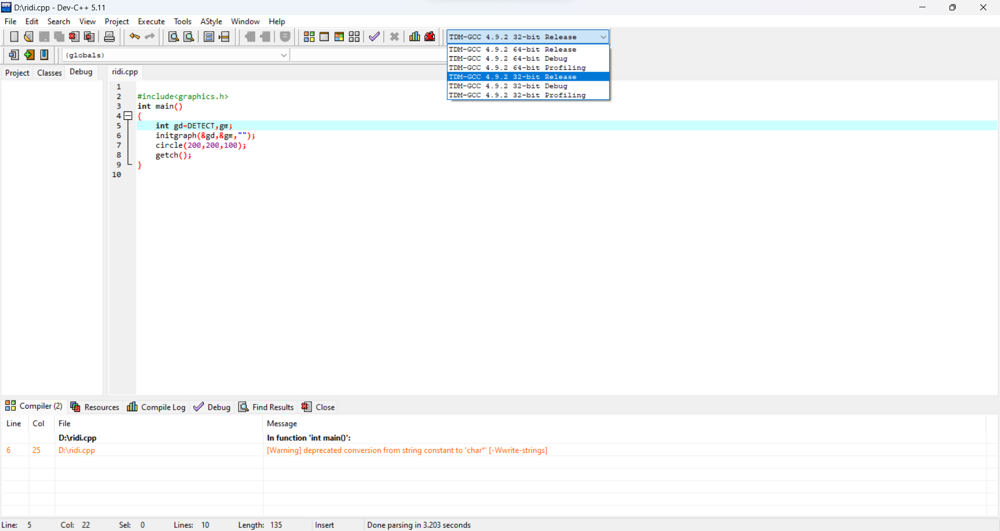
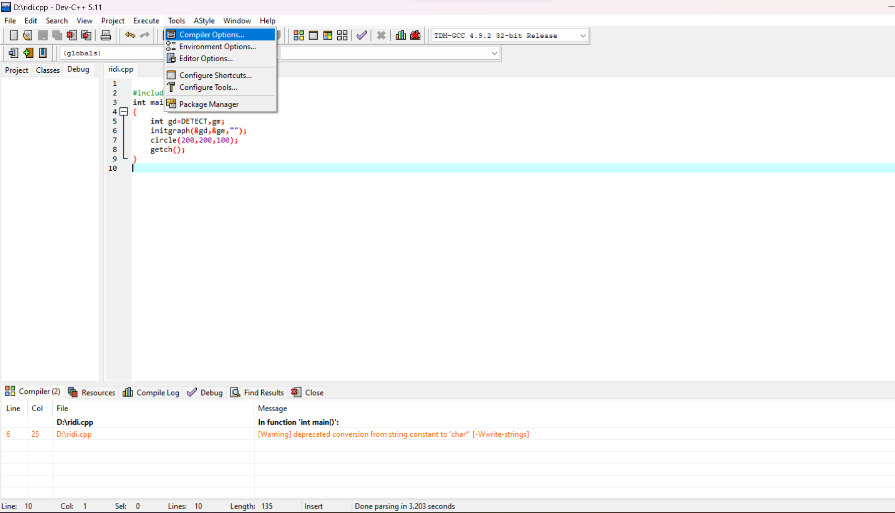
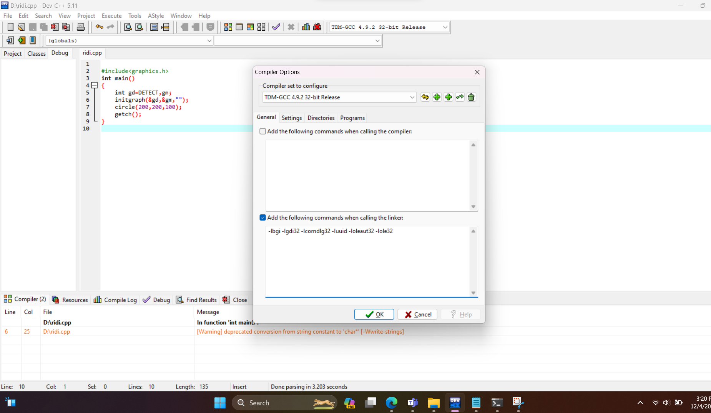

# This repository contains all the necessary compiled files needed to run the graphics.h library in your computer.
## These instructions are based on DEV-CPP IDE which you can download by [clicking here](https://sourceforge.net/projects/orwelldevcpp/files/latest/download)
## The instructions for codeblocks is given in the readme file in the zipped file.

1. First download the  `drivedownloadzip` file from the above repo and extract it on your pc.
2. After that extract the files and paste the `graphics.h` file  and the `winbgim.h` file in the folder `C:\Program Files (x86)\Dev-Cpp\MinGW64\include`.
> [!NOTE]
> The address `C:\Program Files (x86)\Dev-Cpp\MinGW64\include` is the default path for devcpp. You can have a different path if you want,
> just make sure to put the header files in `MinGw64\include\` folder.

3. Now copy the `libbgi.a` to the `C:\Program Files (x86)\Dev-Cpp\MinGW64\lib\` folder.
4. Now open up your dev cpp and on the top right corner select the `TDM-GCC 32-bit release` option as shown in the image:
 

5. On the top of toolbar click on `Tools` and then `Compiler Options` as shown in the image:


6. Now add these flags to the second box of the compiler option: 
<br>`-lbgi -lgdi32 -lcomdlg32 -luuid -loleaut32 -lole32`</br>
 
and click okay.
7. Now create a new file and then compile and run this program to check if everything has been installed properly:
``` # include<graphics.h>
    int main()
    {
	int gd = DETECT, gm;
	initgraph(&gd, &gm, "");
	line(100,300,200,400);
	getch();
	closegraph();
	return 0;
}
